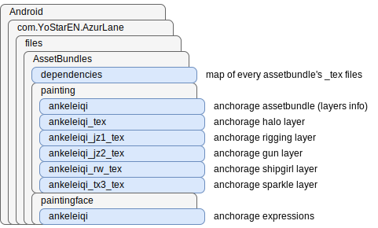

# Azur Lane Painting Reconstruction

Builds sprites from the jumbled Texture2Ds and Meshes available in the `AssetBundles/painting` folder. Also requires the `AssetBundles/dependencies` file. These are both located within `Android/data/com.YoStarEN.AzurLane/files`.

> Other files and folders may also be needed. For example, `painting/kansasi_2_n` contains `paintings/kansasi_2_n` in its `dependencies` list instead of the conventional `painting/kansasi_2_n_tex` file path format.



This repo was inspired by:

* [AzurLane-Painting-Tool](https://github.com/Scighost/AzurLane-Painting-Tool/blob/6d6301257a558d9dbde4a65e4cf25650fca797c8/AzurLane-Painting-Tool/PaintingInfo.cs#L260) by [Scighost](https://github.com/Scighost)
* [painting_reconstruct.py](https://gist.github.com/nobbyfix/fb535462acc897ab1f39e5e9981e4645) by [nobbyfix](https://github.com/nobbyfix)

My `main2.py` script's advantage is in its consideration of the `m_LocalAABB` property of meshes, which contain the `m_Center` and `m_Extent` values of sprite pieces relative to their bounding box.

## Usage

### main2.py

```sh
python -m main2 -p ankeleiqi
python -m main2 -p ankeleiqi -f ankeleiqi -t 2 -o AnchorageSadFace
python -m main2 -c -p ankeleiqi_n -o AnchorageWithoutBG
python -m main2 -k -p tower -o "Tower's full sprite is 5212x8570 px"
python -m main2 -p tower -s pixelcount -o "TowerBelow2048sqpx"
```

* outputs to `output2` folder
* parameters requiring values:
  * `-p`: name of assetbundle file in `painting` folder
  * `-f`: name of face file in `paintingface` folder
    * `-1`: bypass default face detection (otherwise, checks for 0-index face and applies it if found)
    * may leave this undeclared if it's the same as the `-p` value prefix
  * `-t`: name of face index within chosen face file
  * `-d`: directory name, if it isn't AssetBundles
  * `-o`: name of output file
  * `-s`: downscale factor
    * `maxsize` (default): max(width, height) &le; 2048
    * `pixelcount`: width * height &le; 2048<sup>2</sup>
* parameters that are flags:
  * `-c`: trim out whitespace
  * `-k`: output an additional version of sprite at original resolution
  * `-dep`: save dependencies map json file
  * `-fix`: attempt to fix cropping issues by padding intermediate canvases

## Other Scripts

### nobbyfix's script

```sh
python -m painting_reconstruct -d AssetBundles -p ankeleiqi
python -m painting_reconstruct -d AssetBundles -p ankeleiqi -f ankeleiqi -t 2 -o AnchorageSadFace
```

* outputs to root folder
* no longer works
  * game file structure and sprite mesh data were changed on 2024-05-21 (the Light of the Martyrium update) which broke all prior sprite extraction scripts

### main.py

```sh
python -m main -p ankeleiqi
python -m main -p ankeleiqi_jz1
python -m main -p ankeleiqi_jz2
python -m main -p ankeleiqi_rw
python -m main -p ankeleiqi_tx3
```

* outputs to `output` folder
* unlike nobbyfix's script and `main2.py`, the `-p` input is the name of `_tex` files minus the `_tex` (instead of the assetbundle file)
* processes one layer, not an entire sprite
* doesn't consider positioning and scaling info of sprite layers
* can be used instead of `main2.py` to extract a "WithoutBG" sprite even if the game doesn't have the "Hide background objects" option for that particular skin
